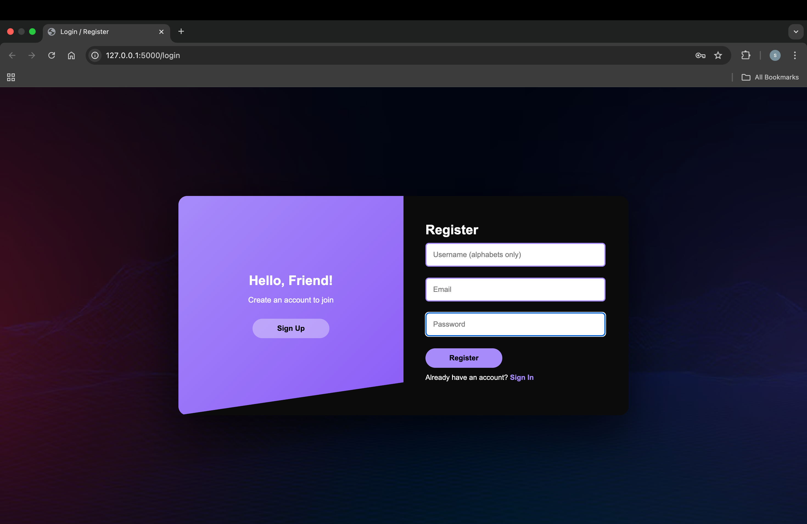
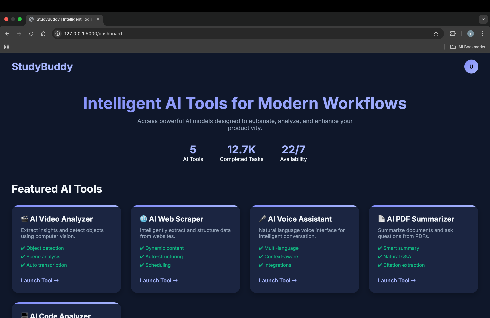
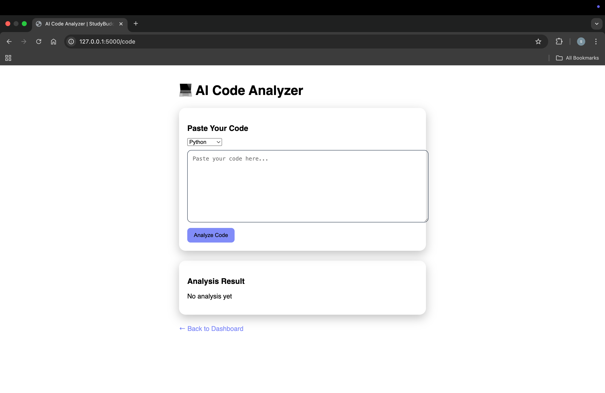
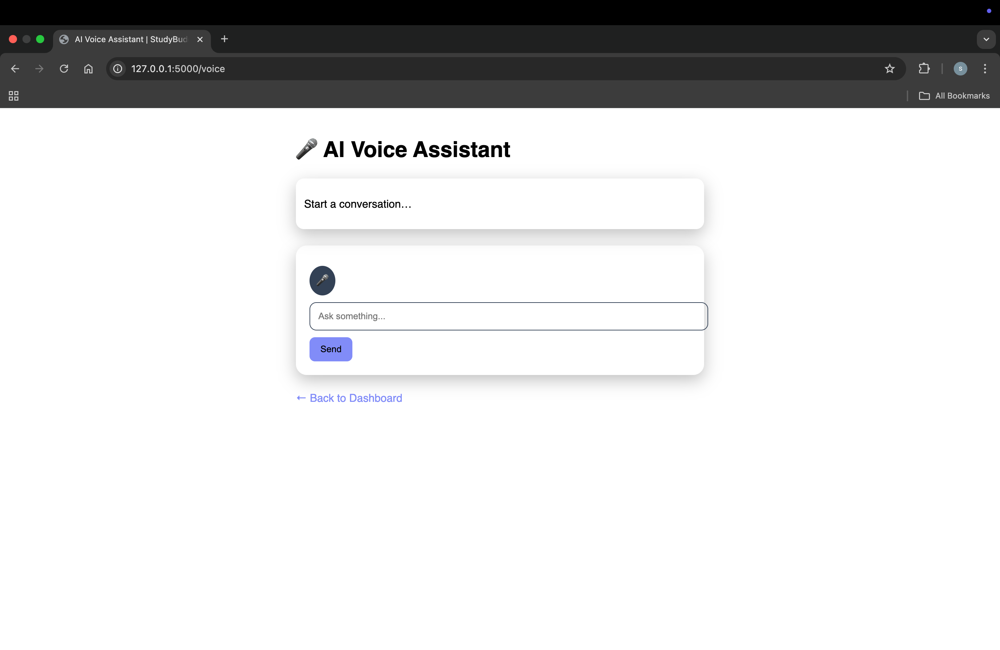
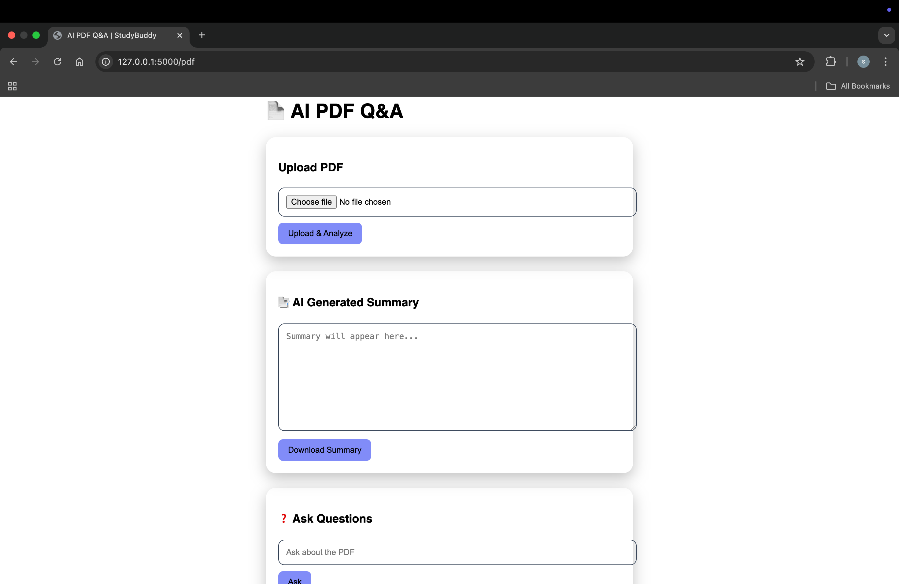
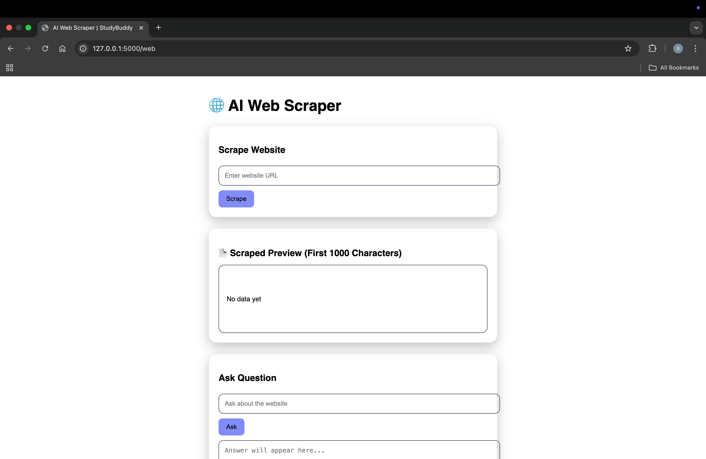
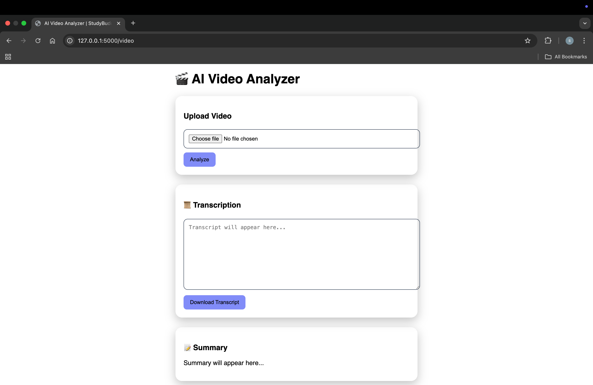

---

# 🎓 StudyBuddy — Offline AI Study Assistant Platform (RAG + Local LLM Ready)


StudyBuddy is an **AI-powered, multi-tool productivity platform** that demonstrates **real-world AI system integration, full-stack engineering, and applied problem solving**.

It is designed as an **offline-first, privacy-aware AI assistant** that helps users analyze **code, documents, videos, voice input, and web content** — all from a single unified interface.

> 🚀 Built with **Flask + Vanilla JS + Python-based AI pipelines**
> 🧠 Architected to support **LLM workflows (OpenAI / Ollama / Local Models)**
> 🔐 Designed with **modularity, extensibility, and system-level thinking**

---

## ✨ Key Capabilities (What This Project Demonstrates)

StudyBuddy is intentionally built as a **systems-style AI project**, showcasing how multiple AI components can be orchestrated into a single application.

### 🧠 AI Code Analyzer

* Static code analysis across multiple languages
* Rule-based optimization & improvement suggestions
* High-level explanations of code logic and structure
* Language-aware feedback (Python, JavaScript, Java, C++)

### 🎤 AI Voice Assistant

* Microphone-based **Speech → Text**
* AI-generated conversational responses
* **Text → Speech** output for hands-free interaction
* End-to-end conversational pipeline

### 📄 AI PDF Analyzer

* Upload and process long PDFs
* Intelligent summarization
* Context-aware question answering from document content

### 🎥 AI Video Analyzer

* Video content understanding
* Transcript-driven analysis
* Scene-level contextual interpretation (conceptual)

### 🌐 AI Web Scraper

* Intelligent website content extraction
* Structured data parsing
* Designed with anti-blocking considerations

---

## 🎯 Why This Project Matters (Recruiter View)

This project focuses on **engineering depth**, not just feature count:

* Modular backend design
* Clear separation of concerns per AI tool
* Extendable AI pipelines
* Ready for **RAG, embeddings, vector search, and LLM inference**
* Demonstrates real-world AI orchestration beyond toy demos

---

## 🎨 UI / UX Highlights

* 🌗 Theme switching (Dark / Light / Warm)
* 👤 Profile menu with settings
* ✨ Smooth animations & transitions
* 📱 Responsive layout
* 🔐 Animated **Login ↔ Register** flow
* Clean dashboard-based navigation

---

## 📸 Application Screenshots

> Visual walkthrough of the platform

### 👤 Login



### 🏠 Dashboard



### 💻 AI Code Analyzer



### 🎤 AI Voice Assistant



### 📄 AI PDF Analyzer



### 🌐 AI Web Scraper



### 🎥 AI Video Analyzer



---

## 🛠️ Tech Stack

### Frontend

* HTML5
* CSS3 (custom design, no UI frameworks)
* Vanilla JavaScript
* CSS Variables for theme management

### Backend

* Python
* Flask
* REST APIs
* Modular routing per AI tool

### AI / Processing

* Rule-based static analysis
* NLP pipelines
* Speech-to-Text & Text-to-Speech
* Designed to integrate:

  * LLMs (OpenAI / Ollama)
  * Embeddings & RAG workflows

---

## 📂 Project Structure

```
StudyBuddy/
│
├── backend/
│   ├── app.py
│   ├── code_analyzer/
│   ├── voice_assistant/
│   └── pdf_analyzer/
│
├── templates/
│   ├── login.html
│   ├── dashboard.html
│   ├── code.html
│   ├── voice.html
│   └── pdf.html
│
├── static/
│   ├── css/
│   ├── js/
│   └── assets/
│
├── requirements.txt
└── README.md
```

---

## ⚙️ Installation & Setup

### 1️⃣ Clone the Repository

```bash
git clone https://github.com/Unknowncoder3/StudyBuddy.git
cd StudyBuddy
```

### 2️⃣ Create Virtual Environment (Recommended)

```bash
python -m venv venv
source venv/bin/activate   # macOS/Linux
venv\Scripts\activate      # Windows
```

### 3️⃣ Install Dependencies

```bash
pip install -r requirements.txt
```

### 4️⃣ Run the Application

```bash
python app.py
```

Open in browser:

```
http://127.0.0.1:5000
```

---

## 🧪 How to Use

1. Login / Register
2. Select an AI tool from the dashboard
3. Upload content or provide input
4. View intelligent analysis & results
5. Switch themes anytime

---

## 🚀 Future Enhancements

* Full RAG pipeline with vector databases
* LLM-powered explanations using local models
* User history & analytics
* Cloud deployment (AWS / Render)
* Role-based authentication
* Real-time collaboration features

---

## 👤 Author

**Snehasish Das**
Final Year CSBS Student | AI & Full-Stack Developer

* GitHub: [https://github.com/Unknowncoder3](https://github.com/Unknowncoder3)
* LinkedIn: [https://www.linkedin.com/in/snehasish-das-7a9803219](https://www.linkedin.com/in/snehasish-das-7a9803219)

---

## ⭐ If you like this project

Give it a **star ⭐** — it really helps!

---
